# Welcome to the Livery Video Guides

Our comprehensive guides are designed to help you get the most out of the Livery platform. Whether you're just getting started or looking to optimize your streaming experience, you'll find step-by-step instructions, best practices, and tips to enhance your use of Livery’s powerful features.
Explore our guides to learn how to set up and manage your account, integrate with third-party tools like Shopify, customize your streaming experience, and more. Each guide is crafted to ensure you have all the information you need to successfully leverage Livery's capabilities for your interactive live streaming needs.

## Connecting Shopify and Livery

The Livery platform allows customers to connect their Shopify store account directly. This integration enables the Shopify Product Interaction feature, allowing customers to search for and pull product data from their Shopify online store. This eliminates the need to manually enter product details.

With the Shopify Product Interaction, the link directs viewers to a specific product in your store while the live stream continues in Picture-in-Picture mode, ensuring they don’t miss anything. All information collected via Livery’s SSO is automatically added to the Shopify purchase form, minimizing the effort needed for transactions.

To connect your Shopify account, follow these steps:

***Enable the Shopify Plugin:***
- Log into Livery’s online management portal.
- Go to the Plugins section in the main menu and find the Shopify plugin.
  
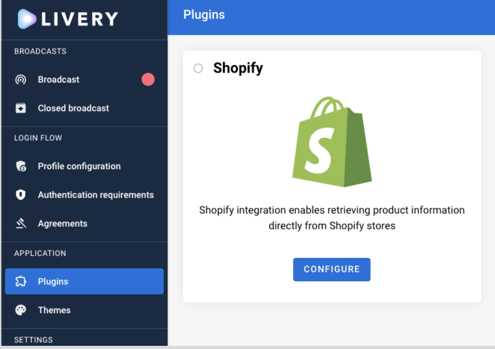
- Enabling the plugin requires a Shopify Domain and Shopify API Access Token.

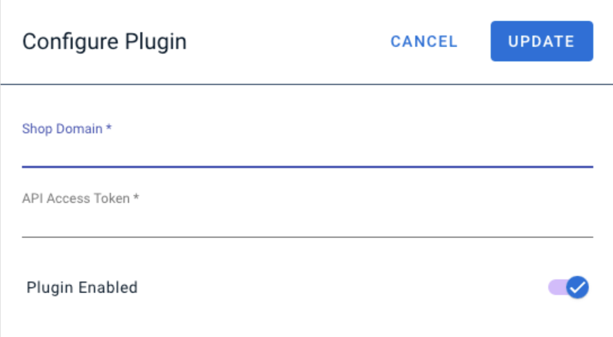

**1) Find Your Shopify Domain:**
- Log into your Shopify portal.
- Navigate to the Settings menu and select Domains.
  
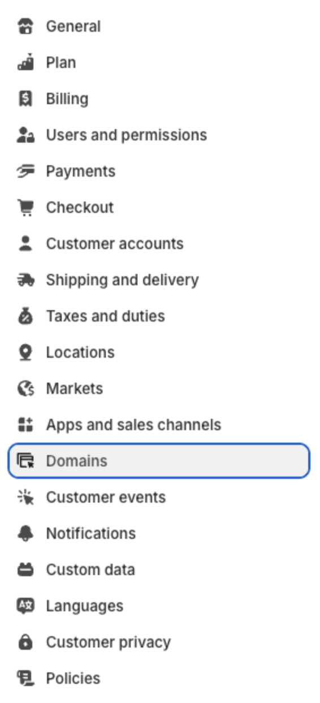
- Copy the domain of your Shopify store and paste it into the appropriate field in the Livery portal. Only the `myshopify.com` domains are supported by Shopify, so alias domains are not supported.

**2) Create a Storefront Access Token:**
- Go to the Settings menu in your Shopify portal and select Apps and Sales Channels.
- Click Develop apps.
- Click Create App, enter an App Name (this can be anything), and choose an App Developer from the dropdown menu.
- Configure the 'Admin API integration' permissions in the Configuration tab. Livery requires two permissions:
  - Product Listings - "read_product_listings"
  - Products - "read_products"
    
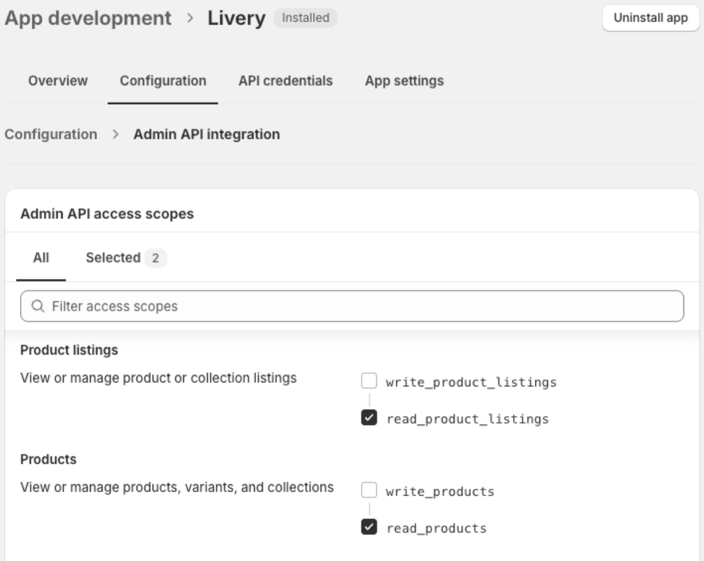
- Configure the 'Storefront API integration' permissions in the Configuration tab. Livery requires one permission:
  - Products - "unauthenticated_read_product_listings"
    
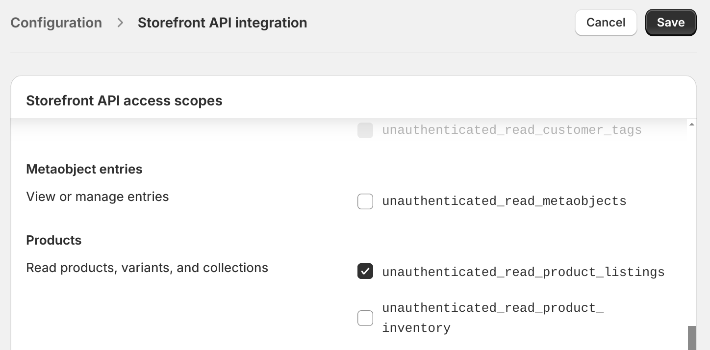

- After setting the permissions, go to the API Credentials tab.
- Install the newly created app by clicking Install App.
  
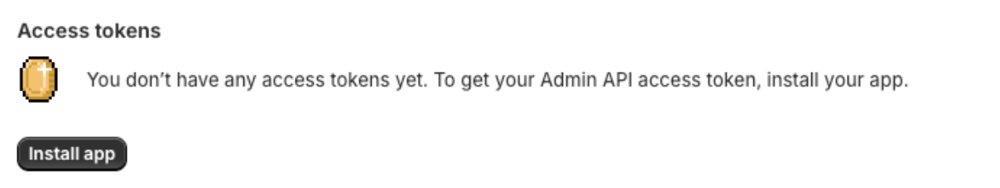
- Once the app is installed, you can reveal and copy the access token. The token starts with "shpat_" followed by an ID. Note that you can only reveal this token once.
  
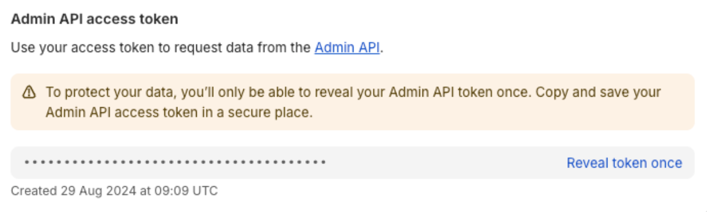
- Copy the token and paste it into the Shopify Token field in the Livery plugin section.

With both the domain and the token is it possible to enable the plugin. A new Interaction type is now available for selection and use.

## Add streaming support (SRT)

Third-party tools are required to ingest a live stream via SRT or RTMP into the Livery platform. While Livery does not provide a mobile streaming library to enable live transmission from mobile devices via RTMP or SRT, there are multiple alternatives available. The following guide explains how to add a transmission library to your application, enabling your customers to stream directly from their native application.

### Streaming support for iOS

To add a SRT ingest to your app you can use [SRTHaishinKit](https://github.com/shogo4405/SRTHaishinKit.swift#-installation) library, to do so:

Start by adding the library through Carthage or manually into your project (CocoaPods and Swift Package Manager are not available)

```groovy
github "shogo4405/SRTHaishinKit.swift" "main"
```

Install library prerequisites

```groovy
brew install cmake
```

Add camera and microphone permissions in your project’s `Info.plist`

```groovy
<key>NSCameraUsageDescription</key>
<string>The app uses the camera to Live Stream </string>
<key>NSMicrophoneUsageDescription</key>
<string>The app uses the microphone to Live Stream </string>
```

- Setup `AVAudioSession`

```groovy
import AVFoundation
let session: AVAudioSession = AVAudioSession.sharedInstance()
do {
    try session.setPreferredSampleRate(44_100)
    try session.setCategory(.playAndRecord, mode: .default, options: [.allowBluetooth])
    try session.setMode(.default)
    try session.setActive(true)
} catch {
    // catch the error here
}
```

- Add a `HKView` or a `MTHKView` to your View Controller

```groovy
var hkView = HKView(frame: view.bounds)
view.addSubview(hkView)
```

- Create and setup the `SRTConnection` and the `SRTStream`

```groovy
let srtConnection = SRTConnection()
let srtStream = SRTStream(srtConnection)

// attach Camera and Audio sources in the stream
srtStream.attachCamera(DeviceUtil.device(withPosition: .back))
srtStream.attachAudio(AVCaptureDevice.default(for: .audio))
```

- Start streaming

```groovy
srtStream.publish("iOS app's stream")
srtConnection.connect("srt://host:port?option=foo") // yours srt ingest URL
```

- Stop streaming

```groovy
srtStream.close()
srtConnection.close()
```

For more details please check the [SRTHaishinKit](https://github.com/shogo4405/SRTHaishinKit.swift#-installation) installation and usage guide.

### Streaming support for Android

To add a SRT ingest to your app you can use [StreamPack](https://github.com/ThibaultBee/StreamPack) library.

Start by adding the library dependencies for SRT:

```groovy
dependencies {
    def streampack_version = ...
    implementation "io.github.thibaultbee:streampack:${streampack_version}"
    implementation "io.github.thibaultbee:streampack-extension-srt:${streampack_version}"
}
```

- You need to add permissions to access the device's camera and microphone.
- Add a AutoFitSurfaceView to preview your stream:

```groovy
    <io.github.thibaultbee.streampack.views.AutoFitSurfaceView
            android:id="@+id/preview"
            android:layout_width="match_parent"
            android:layout_height="match_parent" />
```

- Create and configure a streamer:

```groovy
    streamer = CameraSrtLiveStreamer(
        context,
        enableAudio = true
    ).apply {

        // (https://developer.android.com/reference/android/media/AudioRecord?hl=en#AudioRecord(int,%20int,%20int,%20int,%20int)): "44100Hz is currently the only rate that is guaranteed to work on all devices, but other rates such as 22050, 16000, and 11025 may work on some devices."
        val audioConfig = AudioConfig(
            startBitrate = 128000,
            sampleRate = 44100,
            channelConfig = AudioFormat.CHANNEL_IN_STEREO
        )
        configure(audioConfig)

        val videoConfig = VideoConfig(
            startBitrate = <desired bitrate>,
            resolution = <resolution>,
            fps = 30
        )
        configure(videoConfig)
    }
```

- To start the preview just call:

```groovy
    streamer.startPreview(preview)
```

- To start streaming using an URL just use:

```groovy
    streamer.connect(<srt_ingest_url>)
    streamer.startStream()
```

- At the end don't forget to stop and release the stream and preview:

```groovy
streamer.stopStream()
streamer.disconnect()
streamer.stopPreview()
streamer.release()
```

For more details check [StreamPack](https://github.com/ThibaultBee/StreamPack) quick start guide.

## Use the Frictionless login in combination with MailChimp

Livery's [Unverified Frictionless Auth](frictionless-login.md) (based on OpenId), in combination with its Query Parameter support, is a perfect tool for a smooth transition from personal marketing messages, such as emails, to active participation in an Interactive Live Broadcast. The user is automatically logged in once they navigate to the Livery interactive client via the URL, and with the use of Livery's Custom Dimensions, additional data can be passed along and stored on the user's profile. The following 5 steps explain how to set this up in combination with [MailChimp](https://mailchimp.com/).

**Step 1:**

Choose which extra user details you want to gather and store in the users broadcast profile. To guarantee that each user has a unique personal URL, it's crucial to add a unique `livery_sub` value parameter alongside other relevant details. A `livery_sub` value that is not known by the backend generates a new user, while a `livery_sub` value that is already known by the backend updates or extends the user's profile with the additional details provided via the parameters. These parameters can include the user's email address and name, as well as other information like their company, location, and phone number.

**Step 2:**

Upload your audience to Mailchimp either by uploading a file or entering them manually. When uploading your contacts, make sure to include all the parameters (contact information) that you'd like to add to the users broadcast profile. Also, make sure to match the correct labels to each column of information. These labels will be used in the unique user URLs.

**Step 3:**

Create the URL code that will be included in your email campaign.

An example URL is:

```groovy
https://embed.livery.live/?id=64382097e4b07f0e2af767a5&&livery_sub=*|EMAIL|*&livery_preferred_username=*|FNAME|*&livery_cd1=day1&livery_cd2=email
```

For this example, Livery's embed page is being used, with the specific stream ID contained in the '?id=...' part of the URL. The `livery_sub` parameter is used to determine who the user is. If an unknown value is used, a new user is created. If the 'sub' value is already known, the user's profile is updated. In the example above, the email address is used from each user to make the URL unique, and the first name is used as the preferred username in Livery. Next to the parameters used for the Frictionless login, 2 Custom Dimensions (`livery_cd`) are used to store general information about the campaign.

To ensure that Mailchimp recognizes which email address or name to include in the user URL for each specific user when you send out an email, it is important to use the correct merge tag. Mailchimp offers merge tags for various dynamic information. By inserting a merge tag into your email campaign, you can send personalized content to your subscribers. For instance, to include a user's email address, you should use the merge tag `*|EMAIL|*`. To get a comprehensive overview of Mailchimp's merge tags, please visit <https://mailchimp.com/help/all-the-merge-tags-cheat-sheet/>

**Step 4:**

Create a template email for your email campaign. You can include your URL in multiple ways;

- Add the URL code as text to the template
- Add the URL code as a link to written text (e.g. click here to watch the stream)
- Make a button and connect to URL code to that button

Both option 2 and 3 have an invisible link, so when your contacts receive the email the won’t see the URL with all the parameters.

**Step 5:**

Finalize your email and send out the campaign. Each contact will now receive an email with a unique and personalized URL. Clicking on this link will load the stream and automatically register the user, with a profile containing all the information included in the URL.

## How to live stream with Livery

1. For ingesting video into Livery, enter the Ingest URL and Stream Key in your preferred streaming tool (e.g. OBS, vMix, StreamYard)
2. Check our [recommended settings](video_ingest#mixer-soft-and-hardware) at docs.livery.live for recommended configurations
3. Click the “Start streaming” button in the streaming tool that you are using
4. Our cloud encoder automatically starts
5. After ~60 seconds start-up time, the video will be visible in the player. (The player URL is provided to you or can be specified by the stream ID <https://embed.livery.live/?id>=...)

## WebClip example list

The WebClip interaction is an integrated iframe within the interactive layer of our live-streaming solution, facilitating the seamless embedding of external web content directly into live streams. This feature enhances engagement by dynamically incorporating diverse content types, such as articles, videos, and collaborative documents, in real-time. Explore WebClip to elevate interactivity and audience engagement in your live-streaming sessions. For detailed instructions on how to utilize popular websites with the WebClip, refer to the table below.

| Website       | Compatability                       | Web Clip Size                                                                           | Description  |
|:--------------|:------------------------------------|:----------------------------------------------------------------------------------------|:-------------|
| Amazon        | Show a product                      | Custom size (Width: 80%, 27%). Positioning: Vertical bottom, Horizontal center.| 1. To embed an ad from these platforms, use Iframely:  2. Go to Iframely and create an account. 3. Paste the product link into Iframely. 4. Click “Make it a small card” and copy the link from the embed code. 5. Add “https://” to the beginning of the link if it’s missing. Click “Make it a small card” and copy the link from the embed code.|
| Apple Music   | Share an album or playlist          | Custom size (Width: 80%, Height: 60%).Positioning: Vertical bottom, Horizontal center. | 1. Click on the three dots next to the playlist or album. 2. Choose “Share” and then “Copy Embed code.” 3. Paste the code into a document and copy the link from it.|
| Apple Music   | Share a song                        | Custom size (Width: 80%, Height: 30%). Positioning: Vertical bottom, Horizontal center.| 1. Click on the three dots next to the song. 2. Choose “Share” and then “Copy Embed code.” 3. Follow the same steps as for an album or playlist.  |
| Bol.com       | Show a product                      | Custom size (Width: 80%, 35%). Positioning: Vertical bottom, Horizontal center.| See Amazon description|
| Ebay          | Show a product                      | Custom size (Width: 80%, 32%). Positioning: Vertical bottom, Horizontal center.| See Amazon description|
| Etsy          | Show a product                      | Custom size (Width: 80%, 25%). Positioning: Vertical bottom, Horizontal center.| See Amazon description|
| Figma         | Show a design                       | Full size                                                                               | To share a Figma project, click on “Share” and then “Get embed code.” Copy the link from the embed code.                                                                                      |
| Google Docs   | Work together on a document         | Full size                                                                               | For Google Docs, click on “Share” and then “Copy link.” Ensure that the people you’re sharing the document with have the appropriate rights to view or edit it, depending on your intentions. |
| Google Form   | Fill in a form                      | Small size. Positioning: Vertical bottom, Horizontal center.                            | Click on “Send,” then select “Send with link,” shorten the URL if needed, and copy the link.                                                                                                  |
| Google Slides | Presentation                        | Small size. Positioning: Vertical center, Horizontal center.                            | Click on “File,” then “Share,” and “Publish to web.” Ensure that viewers have the appropriate viewing rights.                                                                                 |
| Google Slides | Work together on a presentation     | Full size                                                                               | Click on “Share” and then “Copy link.” Make sure that the individuals you’re sharing the presentation with have the necessary rights to collaborate on it.                                    |
| Instagram     | Show a post                         | Full size                                                                               | Click on the three dots on the right side of the Instagram post, select “Embed,” and copy the link from the embed code                                                                        |
| Marktplaats   | Show a product                      | Custom size (Width: 80%, 78%). Positioning: Vertical bottom, Horizontal center.| See Amazon description|
| Mentimeter    | Host a quiz, presentation or survey | Full size                                                                               | Click on “Share” and copy the invite link.                                   |
| Spotify       | Share an album or playlist          | Custom size (Width: 80%, Height: 30%). Positioning: Vertical bottom, Horizontal center. | 1. Click on the three dots on the playlist or album. 2. Choose “Share” and then “Embed Playlist.” 3. Click “Show code” and copy the link from the generated iframe code.|
| Spotify       | Share a song                        | Custom size (Width: 80%, Height: 30%). Positioning: Vertical bottom, Horizontal center. | 1. Click on the three dots next to the song. 2. Choose “Share” and then “Embed Track.” 3. Follow the same steps as for an album or playlist.|
| Sudoku        | Make a Sudoku                       | Full size                                                                               | For Sudoku, copy the link from the browser’s address bar.                                                                                                                                     |
| Twitter       | Show a tweet                        | Small size. Positioning: Vertical bottom, Horizontal center.| Click on the three dots on the right side of the tweet, select “Embed,” and copy the link from the embed code.|
| Vimeo         | Play a video                        | Small size. Positioning: Vertical bottom, Horizontal center.                            | To share a Vimeo video, click on “Share” and copy the link from the “Embed” option.                                                                                                          |
| Wikipedia     | Browse pages                        | Full size                                                                               | To share a Wikipedia page, simply copy the link from the browser’s address bar.                                                                                                               |
| Youtube       | Play video                          | Full size                                                                               | To share a YouTube video, click on “Share” below the video, then select “Embed” and copy the link from the iframe code.                                                                       |
| Zoom          | Have an online meeting              | Full size                                                                               | To share a Zoom call, create a new meeting and copy the invite link.                                                                                                                          |

# How to create an interactive broadcast

1. You receive an email for account activation that enables you to access the Livery portal.
2. In the portal, press the button +CREATE in the middle of your screen or press the button +ADD in the top right corner to add a broadcast.

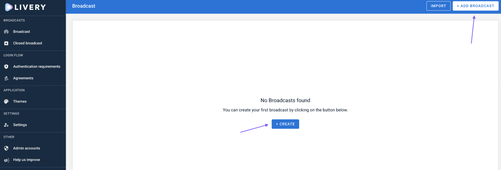

3. Configure the broadcast details and choose the features you would like to activate (can be changed later)
4. Click on ADD at the top right corner to proceed.

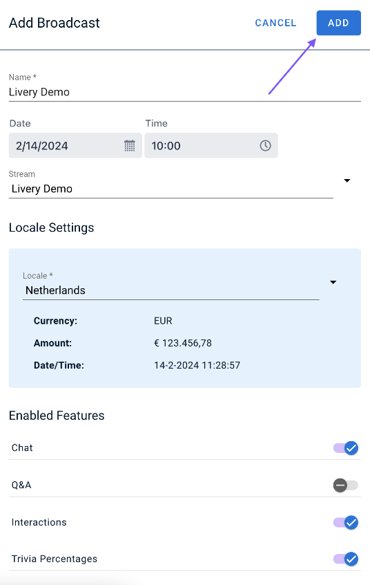

5. Press the +CREATE button in the center of your screen to configure your first interaction

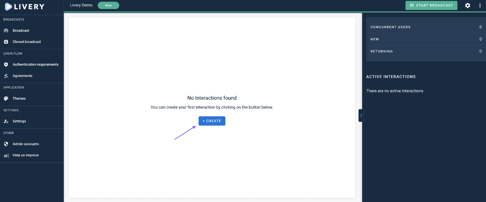

6. Choose the interaction you would like to add from the dropdown menu.
7. Fill out the required fields marked with an asterisk (*).

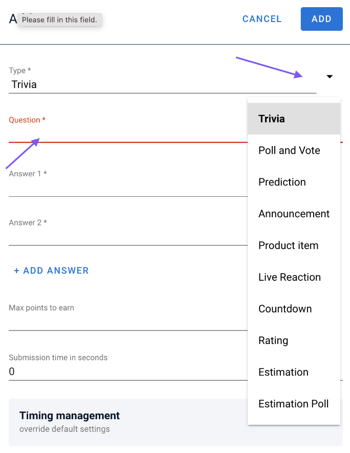

8. Press the ADD button at the top right corner to add the interactive feature to the timeline.
9. Press the ADD INTERACTION button at the top of the timeline to add more interactions.

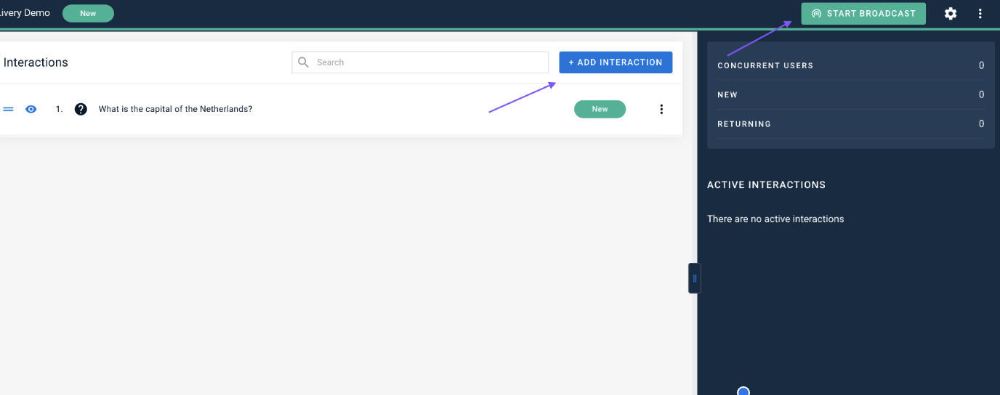

10. Click on START BROADCAST on the top right corner to display the interactive overlay in the player (interactions can be created at any time also during the live stream).
11. Broadcast Settings can be changed at any time by clicking on SETTINGS ICON on the top of the screen.

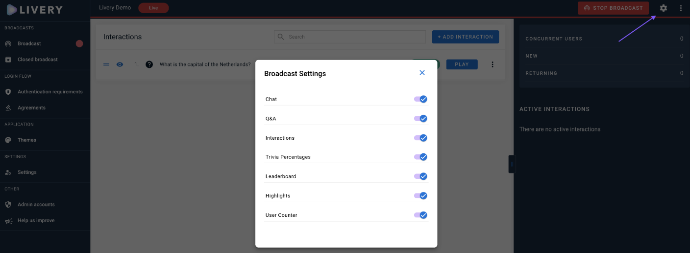

12. Press PLAY to show the interaction in the player, e.g. asking a trivia question to the users


13. You can find all OPEN interactions on the right side under ACTIVE INTERACTIONS

- you can manually STOP an interaction at any time or wait until the timer is up (if configured)
- click on the arrow to see real-time results


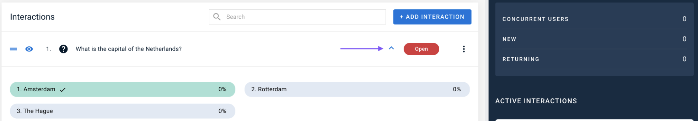

14. Additional features, such as Q&A overview and Presenter View, can be found next to the Broadcast Settings. Click on the THREE DOTS in the top right corner to open the menu.

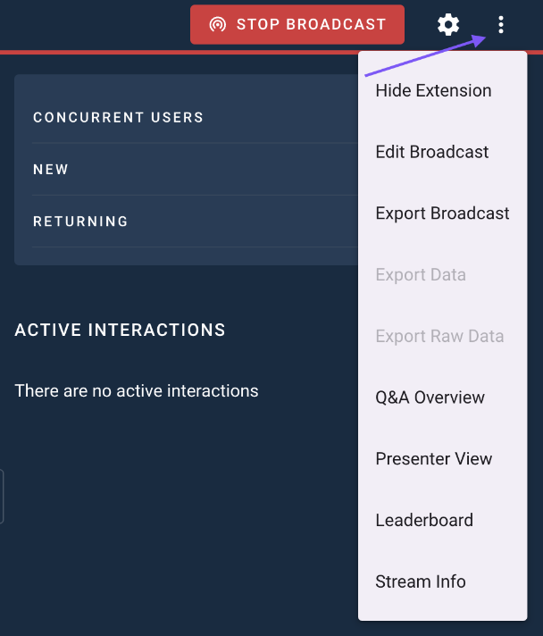

15. Press STOP BROADCAST on the top right corner when you want to end the interactive broadcast (only the interactive overlay will be disabled, the ingested video will still be shown in the player).

# Wix site in combination with Livery

The Livery video player can be added to a [Wix](https://www.wix.com/) powered website. The following guide explains in 4 steps how to add the player.

Step 1: When editing a webpage, choose Add → Embed Code → Popular Embeds → Custom Element

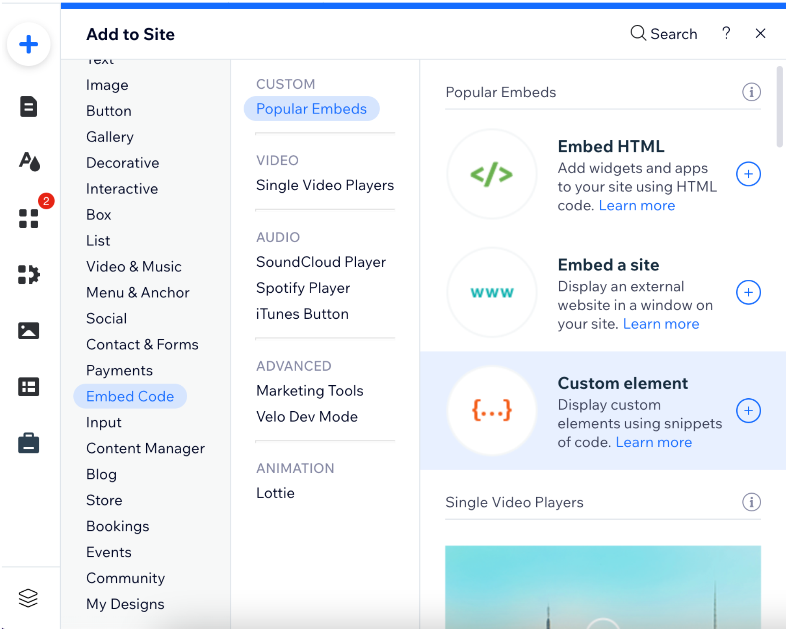

Step 2: Click on "choose source" and add the server URL "https://cdn.jsdelivr.net/npm/@liveryvideo/player@X.Y.Z" as well as the tag name "livery-player". The latest player version is:
[](https://www.npmjs.com/package/@liveryvideo/player)

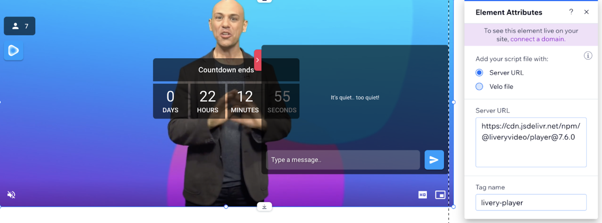

Step 3:Close the window and “add attributes”. Here you have to enter the “streamid” that you can find in the video portal or after request.

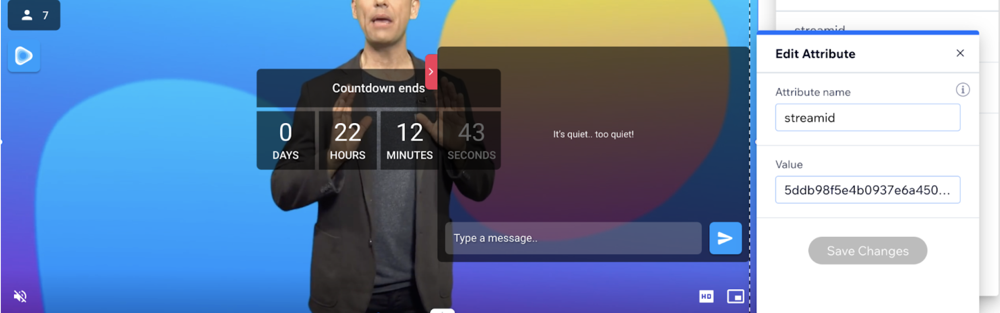

Step 4: Close the window and you can add additional attributes, such as the dimensions of the player, as well. More information can be found at official Wix guidelines: <https://support.wix.com/en/article/wix-editor-adding-a-custom-element-to-your-site>

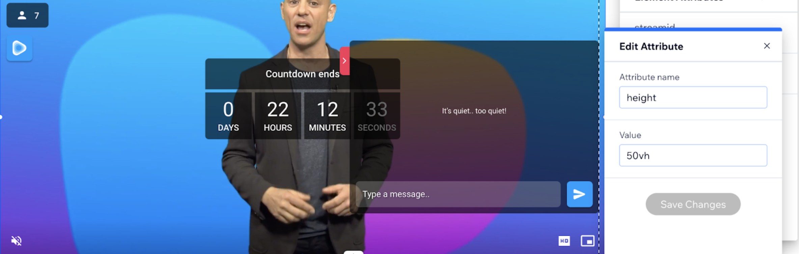

# Livery IDs explained
The Livery solution uses multiple IDs to connect all of its elements together. The IDs referenced throughout our documentation and solution include:

- StreamId
- TenantId
- BroadcastId
- UserId
- Sub

## StreamId
The StreamId is used by the player SDK to load the correct configuration. This configuration specifies details such as which stream to play (m3u8 and MPD URLs), the interactive client URL, and other player-specific information.

For example, if the web player SDK is implemented on multiple websites using the same StreamId, it will behave consistently across those sites. If different StreamId values are used, you can display different configurations or information on each site.

## TenantId
The TenantId is a unique identifier within the Livery interactive solution, think of it as a customer ID. Each Livery customer is assigned a unique TenantId, which is included in the interactive client URL. This ensures that the interactions users see belong to the correct customer.

A single TenantId can be linked to one or more StreamId values. In other words, the interactive client URL (which contains the TenantId) is part of the player configuration and loads alongside its respective video URLs. This setup allows you to use the same interactive client across multiple StreamId values, such as for multiple camera angles of a single event or different languages, all while using the same interactive features.

It is also possible to load the interactive client URL directly, outside the video player SDKs. This is done to provide a second screen experience or for Hybrate events. 

## BroadcastId
The BroadcastId is unique to a specific interactive broadcast, which has a defined start and end time. During the broadcast, the customer can collect and store interactive and game data. Each TenantId can only have one active (open) BroadcastId at a time, although multiple BroadcastId values can exist in different states (e.g., "new" or "closed").

## UserId and Sub
The UserId is a unique identifier generated by the Livery solution, scoped to a specific tenant. The same UserId can appear in multiple BroadcastId contexts if the user has participated in more than one broadcast.

The Sub is a user identifier provided by the customer, which must also be unique. Its primary purpose is to map Livery UserId values to user IDs from third-party login systems, ensuring consistent user identification across different platforms.
