# Interactive Portal

Livery Interactive is a cloud based solution which brings true, interactive video within everyone’s reach on web, iOS and android devices. The responsive design ensures that on all devices you can enjoy the same experience.
With our product we provide you a fun and interactive way to enrich your broadcast event and at the same time create engaging experiences that are in perfect sync with the video.
Livery Interactive and Livery Video offered together but both parts of our product can be used separately as well.

On top of the video player sits the interactive layer, this is where your audience will see all interactions when they join your live broadcast event. You can plan, build and play all interactions in an intuitive web-based management system, designed to ensure that even one person can easily manage the elements of your broadcast but it is also supported to let multiple operators work together.

All important video management features are available within the web-based management system to provide an interface where both parts of the Livery product can be managed together.

Within Livery interactive the broadcast is the grouping entity of all the settings and interactions that you’d like to display to your audience during your broadcast event.
The interactions can have the following phases, all managed by the operators in the web-based management system:

- New: a new interaction in the timeline, still editable, not visible for the audience
- Open: the interaction has been played and showed to the audience, the end-users can interact
- Pending: the interaction is stopped, end-users can no longer interact with it but the results are not yet published
- Result: the results are published for the end-users
- Closed: the interaction is closed, the end-users can no longer see them in the interaction list

#### Poll and Vote

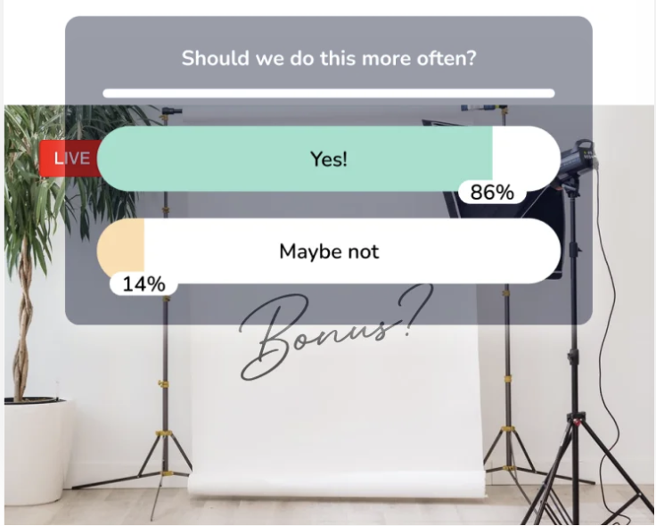

The poll interaction is meant to prepare poll or vote questions with one question and multiple answers. Points are not added to these questions.

Key features:

- Up to 4 answers in vertical, 6 answers in grid or 20 answers in a dropdown layout
- Grid layout supports text, image or emoji answer options
- Custom background colour on answers
- Optional time limit for answers
- Optional hiding of the question text
- Optional forcing of the interaction to the foreground

#### Trivia

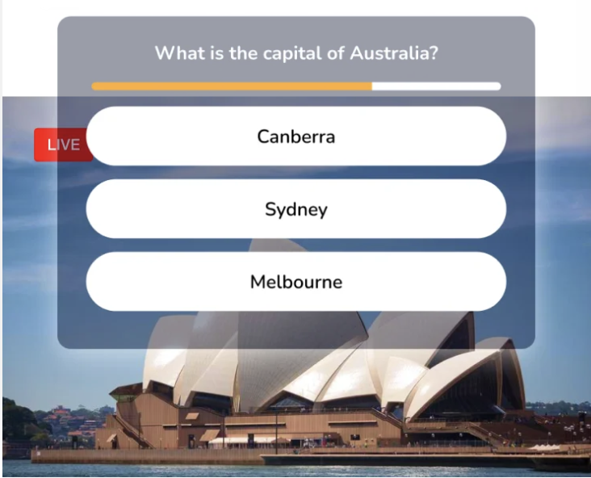

The trivia interaction is meant to prepare trivia questions with one question and multiple answers where the correct answer(s) are marked. Eventual points will be calculated based on the player’s answers and optionally the time of answer or odds or waged amount, and these points will affect their position in the leaderboard.

Key features:

- Up to 4 answers in vertical, 6 answers in grid or 20 answers in a dropdown layout
- Grid layout supports text, image or emoji answer options
- Custom background colour on answers
- Optional time limit for answers
- Optionally attached points
- Leaderboard results
- Showing percentage of provided answers
- Optional time-based scoring
- Optional odds can be added
- Optional betting can be configured
- Optional hiding of the question text
- Optional forcing of the interaction to the foreground
- Show/hide the percentage of the results

#### Estimation poll

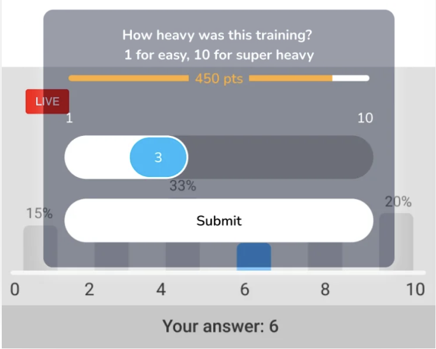

 
The estimation poll interaction is meant to prepare questions with answers within an interval. Scores are not added, this interaction provides the poll/vote result on a column chart including the average of given answers.

Key features:

- Slider or free value input
- Line diagram of result
- Optional time limit for answers
- Optional hiding of the question text
- Optional forcing of the interaction to the foreground
- Show/hide the percentage of the results

#### Rating

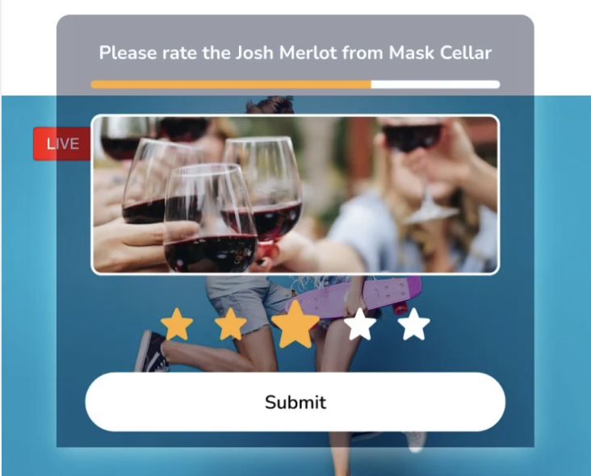

When you’d like to ask the opinion of your audience about a certain topic, you can set up a rating interaction.

Key features:

- Attached image
- Rating result override
- Link to product items
- Optional time limit for answers
- Optional hiding of the question text
- Optional forcing of the interaction to the foreground

#### Announcement

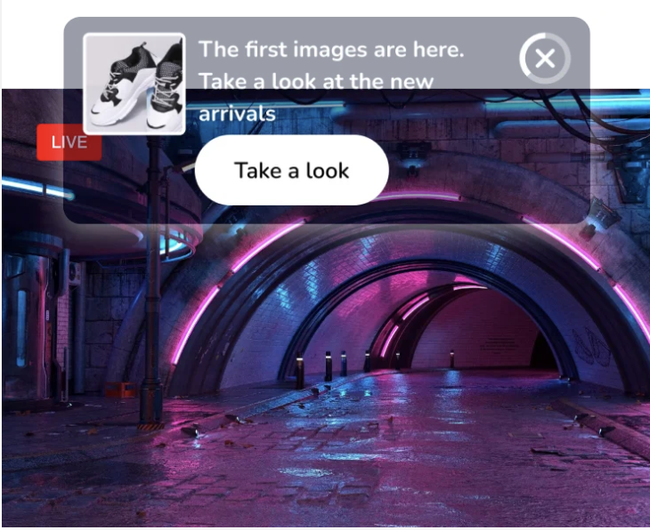

The announcement interaction is meant to prepare quick announcements with title and subtitle. This is shown only one time in the front-end, later the interaction disappears and can't be rewatched.

Key features:

- Quick announcement
- Image upload
- Button with external url

##### Picture in picture

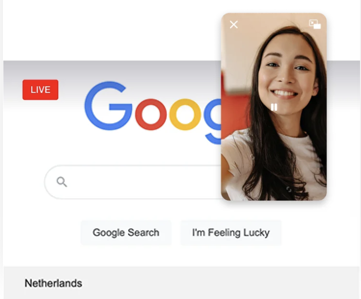

When an announcement, product item or shopify product item has a button which opens an external link, picture in picture mode of the video can be configured.

#### Live reaction

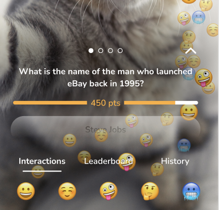

To offer the option to express feelings during the broadcast, live reaction emojis can be shown.

Key features:

- Up to 5 emojis can be added in the selector from a standard list of emojis
- Unlimited sent reactions during broadcast

#### Countdown

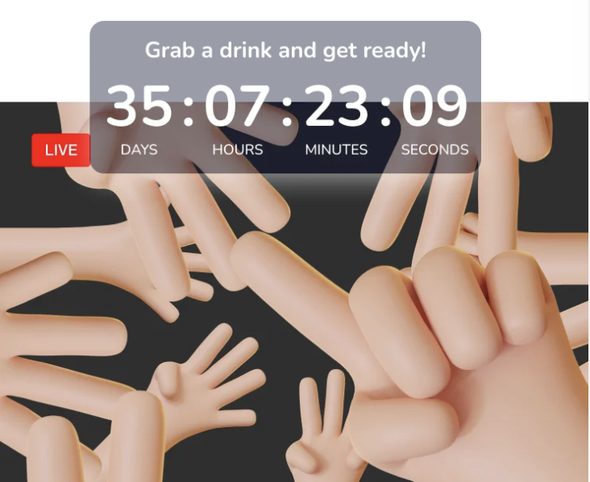

The countdown indicates how much time is left before the broadcast event is starting. It shows days, hours, minutes and seconds.

Key features:

- Date and time selector in the web-based management system
- Audience can already interact before the time is up
- Configurable title
- Configurable message for the last 60 seconds

#### Chat

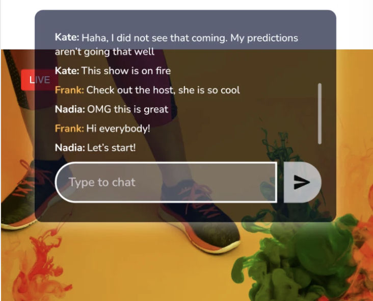

The audience can chat with each other via the chat module.

Key features:

- Rate limit to avoid spamming
- Enable/disable chat in the web-based management system

#### Q&A

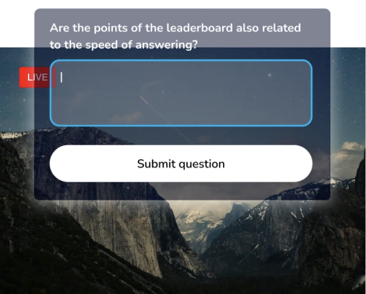

When the Q&A session is open the audience has the option to raise questions which the operator can manage in the web-based management system.

Key features:

- Approve, answer options of questions
- Show/hide in Client and/or Presenter view
- Rate limit on question submission (avoid spamming)
- Enable/disable q&a in the web-based management system
- Pinning
- Filtering
- Search

<!--
#### Social share

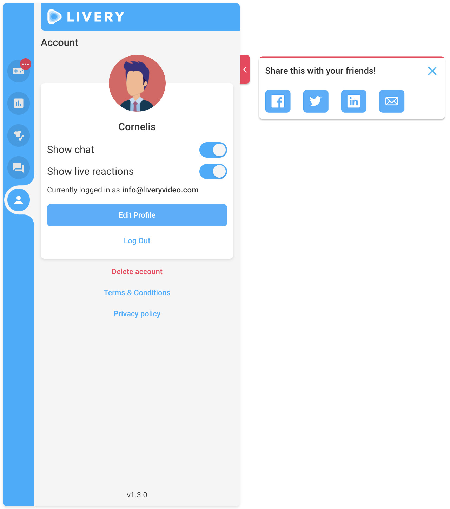

With the social share interaction you can encourage your audience to share a short message on social platforms.

Key features:

- Predefined message
- Native share functionality on mobile devices
- Selected sharing platforms on desktop
- Option for auto or manual closing
-->
#### Estimation

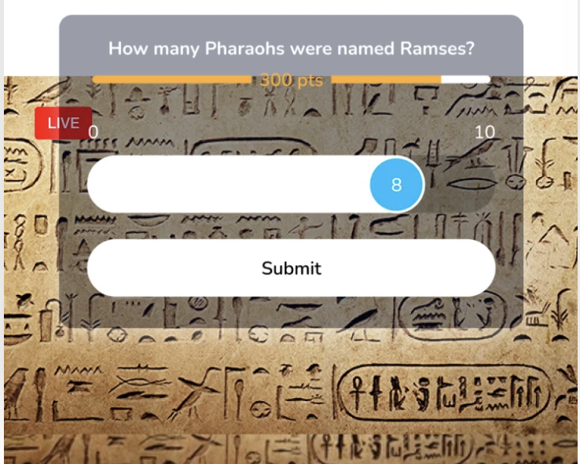

The estimation interaction is meant to prepare questions with answers within an interval. Points will be calculated based on the player’s answers and these points will affect their position in the leaderboard.

Key features:

- Slider or free value input
- Score deduction per steps
- Optional time-based scoring or no-points setup

#### Prediction

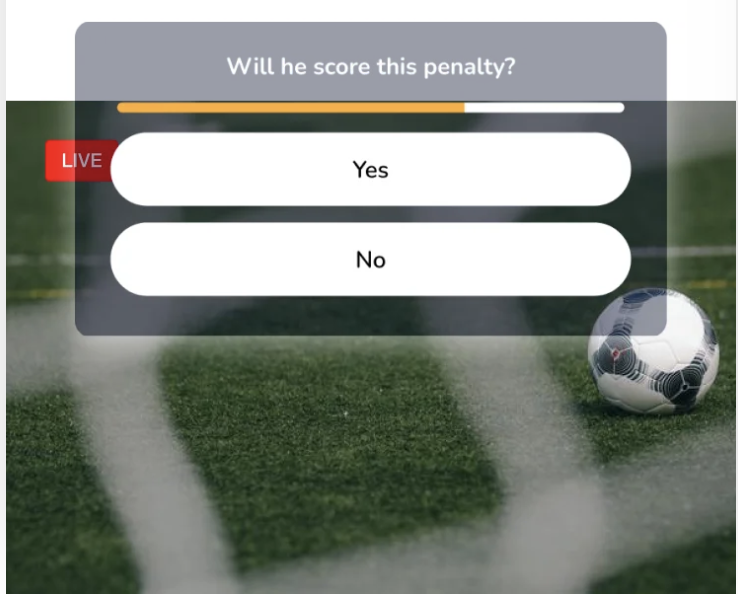

The prediction interaction is meant to prepare questions with one question and multiple answers where the correct answer(s) are not yet known. Points will be calculated based on the player’s answers and these points will affect their position in the Leaderboard.

Key features:

- Up to 4 answers in vertical, 6 answers in grid or 20 answers in a dropdown layout
- Grid layout supports text, image or emoji answer options
- Custom background colour on answers
- Optional time limit for answers
- Optionally attached points
- Leaderboard results
- Showing percentage of provided answers
- Optional time-based scoring
- Optional odds can be added
- Optional betting can be configured
- Optional hiding of the question text
- Optional forcing of the interaction to the foreground
- Show/hide the percentage of the results

#### Estimation prediction
<!--

 -->

The estimation prediction interaction is meant to prepare questions with answers within an interval where the correct answer is not yet known. Points will be calculated based on the player’s answers and these points will affect their position in the leaderboard.

Key features:

- Slider or free value input
- Score deduction per steps
- Optional time-based scoring
- Optional hiding of the question text
- Optional forcing of the interaction to the foreground
- Show/hide the percentage of the results

#### Leaderboard

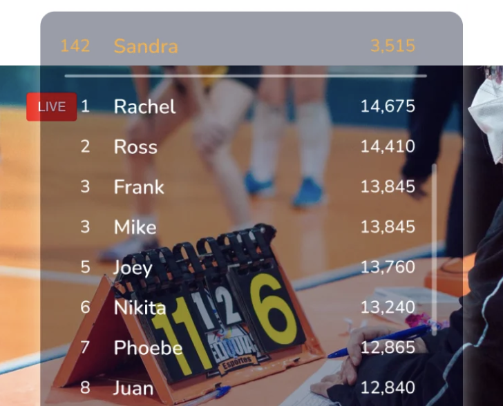

The Leaderboard shows the earned points of the players during the broadcast.

Key features:

- Actual user is always in the top
- Top positions are highlighted

#### Product item

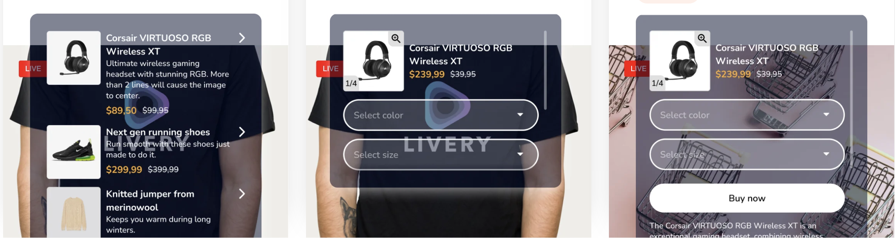

For product promotions the product item interaction can be used.

Key features:

- Discount price
- Attached rating
- Multiple attributes (size, color, etc.)
- Copy change of the Buy button

#### Shopify product item
<!--

 -->
To inlcude a product out of your shopify store the Shopify product item interaction can be used.

Key features:

- easy integration on plugin page
- available product data is pulled in automatically
- optional notification can be added

#### Webclip

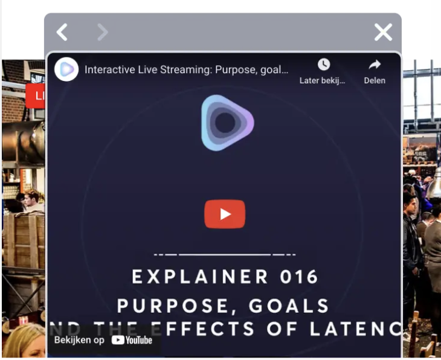

With the webclip interaction external content can be embed in the interactive client

#### Word guessing

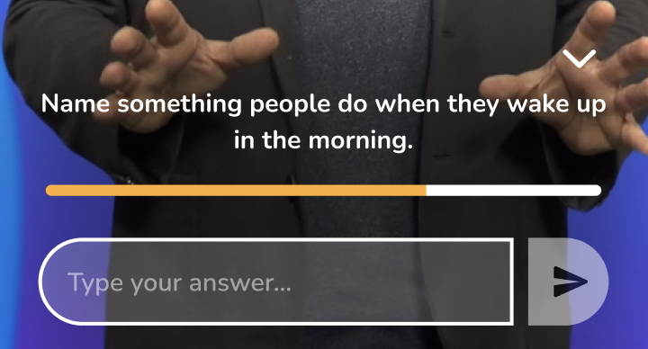

The word guessing interaction is meant to prepare questions with one question and multiple answers where the correct answer(s) are defined. Eventual points will be calculated based on the player’s answers and these points will affect their position in the leaderboard.

Key features:

- Up to 8 correct answers
- For each answer up to 10 synonyms
- Synonyms can be AI generated
- Fuzzy loginc for typos or misspelled answers
- Optional time limit for answers
- Optional attached points per answer
- Leaderboard results
- Optional hiding of the question text
- Optional forcing of the interaction to the foreground

#### Captions and subtitles
AI generated captions can be added to the stream.

Key features:

- easy integration on plugin page
- integration with Rev.ai or Speechmatics
- subtitles can be shown/hidden by the end-user
- language selector in client

#### Social share (coming soon)

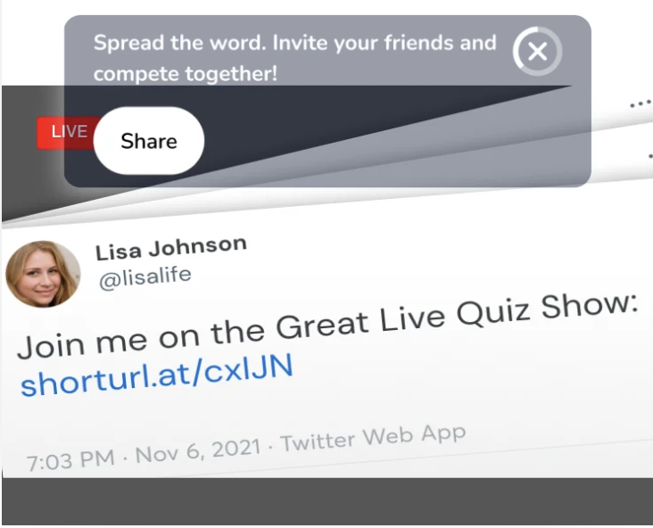

### Management features

These powerful management features give you the opportunity to configure your broadcast, target it for your audience and provide you data and analytics to make your broadcast event even better.
The features are Broadcast management, Account management, Currency handling, Theming, Show/Hide pages or features, Presenter view and Data export. All these management features, real-time interaction results and analytics are provided by our web-based management system.

#### Broadcast management

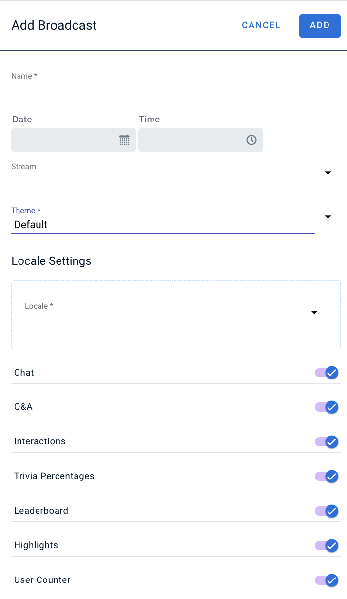

Broadcast is the main grouping element within our system.
For every broadcast event you set up a broadcast within the web-based management system where you define the details above..
Once you have a broadcast defined, you can start to add interactions to it to fill up your timeline.

| Field               | Description                                                                          |
| ------------------- | ------------------------------------------------------------------------------------ |
| Name                | The name of the broadcast                                                            |
| Start date and time | The planned “Date” and “Time” of the broadcast                                       |
| Stream              | The list of available stream in case Livery Video is configured                      |
| Theme               | The selected branding of the interactive layer                                       |
| Locale              | The locale which defines how the currencies, amounts and date/time will be formatted |
| Starting points     | The points which every user will start with when they join the broadcast             |
| Enabled features    | All the features and pages which you’d like to show to your audience                 |

The web-based management system allows you to manage your broadcasts and get an overview of your previous items.

Key features:

- Use default authentication method
- Select your locale
- Define starting points
- Start/stop your broadcast anytime you want
- Select a theme for your branding
- Show/Hide features and pages
- Video Stream selection

#### Account management
<!--

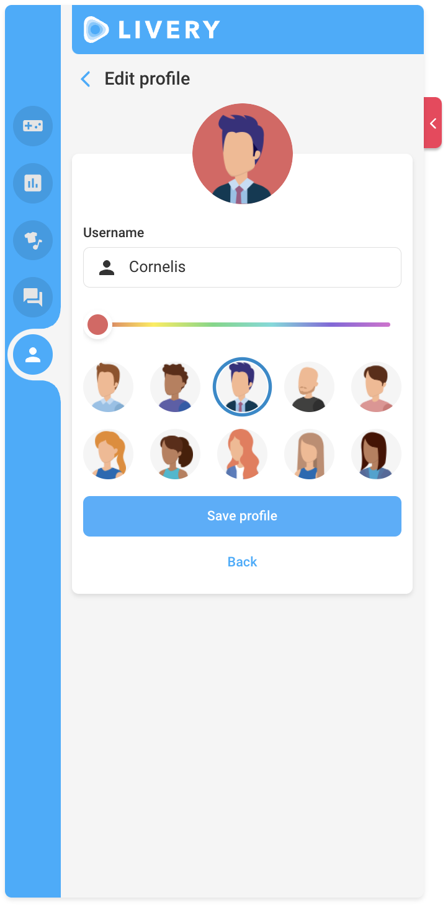

 -->
To use the interactive features the players need to log in or set up a guest user.

Key features:

- Verification code for logging in
- Users can be removed
- Leaderboard results are attached to users
- Show/Hide live reactions
- Disclaimers based on the authentication template

#### Currency handling

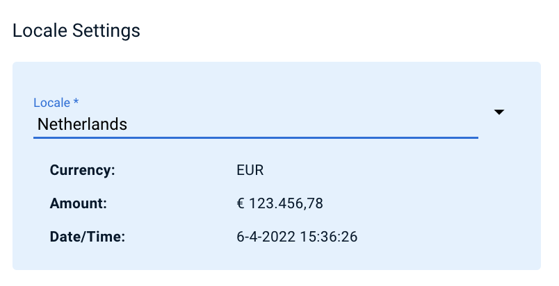

The Broadcast’s locale can be selected on the Broadcast's form. This will define how currencies, amounts, date/time format and language will be shown on the front-end.

Key features:

- Predefined list (easy adjustment)
- Preview of values

#### Theming

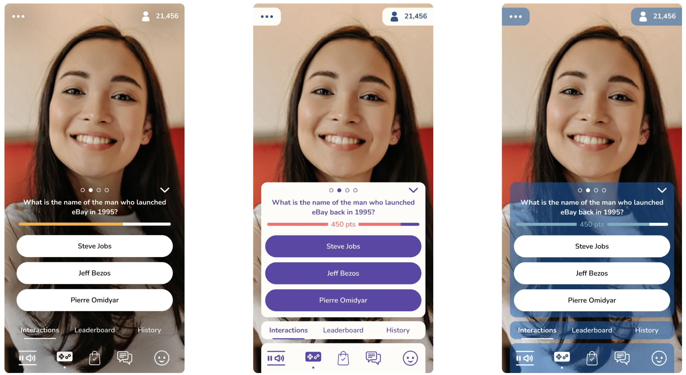

 
The look and feel of the interactive features can be defined via Themes. The web-based management system offers an easy to use way to change colours and logos easily.

Key features:

- 10 colors generates a new look
- Default theme setup (on customer level)
- Theme definition on broadcast level

#### Show/Hide pages or features

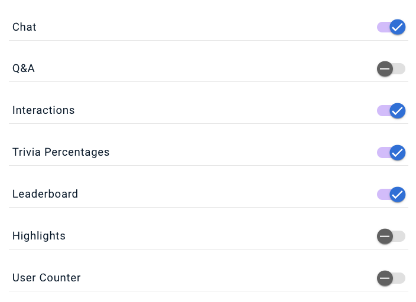

You can select which pages and features you’d like to add to your broadcast out of the list of:
- Chat
- Q&A
- Interactions
- Leaderboard
- Highlights (product items)
- Showing percentage of provided answers
- User counter

#### Authentication 

The following login methods are supported:
- Log in as Guest
- Email verified
- Phone number verified
- Unverified frictionless login
- Verified frictionless login via JWT token

On all login fields non-latin characters are also accepted.

#### Presenter view

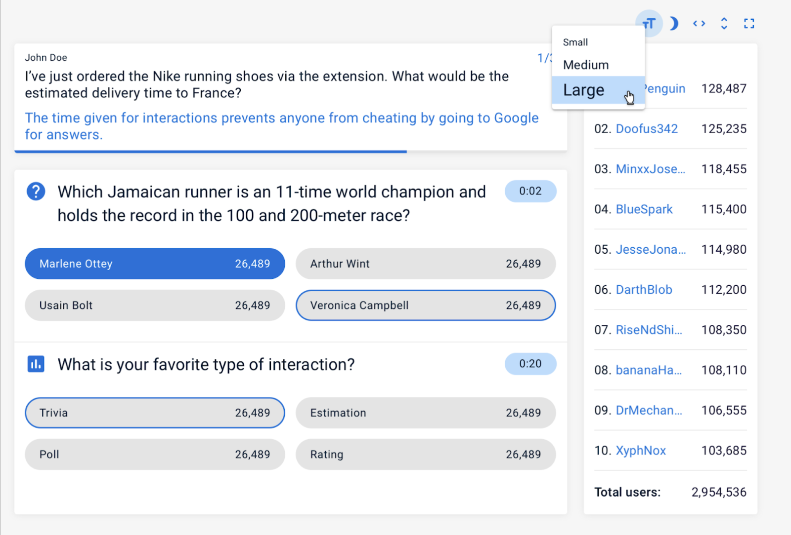

During the broadcast event the Presenter can check the interaction results, live reaction activity or the raised Q&A questions on this dedicated page.

Key features:

- Without clicking the content can be seen
- Automated timer for scrolling the content
- Flipping screen horizontally or vertically
- Full screen option
- Font size setup
- Leaderboard top 10

#### Q&A overview
In the management portal all submitted questions can be approved, answered and shown to the users or the presenter.

#### Interaction forcing
Forcing to the foreground can be set on interaction level in the management portal. Default tenant setting can be added.

#### Interaction and Broadcast scheduling
Every broadcast and interaction can be scheduled by setting start- and end-time to their phases in the management portal. 

#### Data export

During the broadcast event we collect information about user’s reactions and actions,. This data can be downloaded via the web-based management system, structured into the following reports:

- Broadcast data
- User information including leaderboard ranking and earned points
- Chat messages
- Q&A questions and answers
- Poll, Trivia, Prediction interaction data
- Estimate interaction data
- Rating results

#### Livery Video Integration - Video Stream Control

The most important Video stream settings and management is available via the web-based management system, so everything can be set up in one place end to end.

#### Interaction API

When you’d like to access the statistics of the interactive layer, you can use our Interaction API and with the available data build your overview.

<!--
#### Audience groups

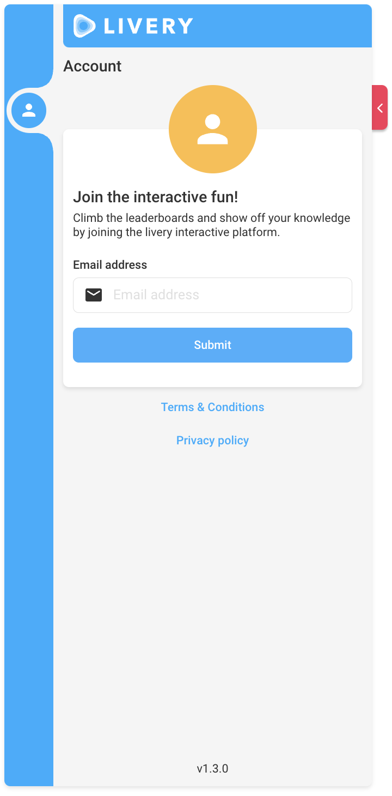

With audience groups you can set up a broadcast which is available for only a closed group of users.

Key features:

- Audience group management in the web-based management system
- Individual emails or full domains can be included
- Exclude guest user option

#### Google Analytics integration

To collect analytical data, Livery supports Google Analytics integration.

### Revision History

| Version                                        | Description                                                                                                                                                                                                                                                                                                                                                             |
| ---------------------------------------------- | ----------------------------------------------------------------------------------------------------------------------------------------------------------------------------------------------------------------------------------------------------------------------------------------------------------------------------------------------------------------------- |
| Client: 1.6.3 Server: 1.16.0 CMS: 2.2.1  | - CMS feedback form - Export/Import of Themes and Audience groups - Search on Audience groups - Toast message for data exports - Add participant number to Estimation poll details - Client localisation updates                                                                                                                                      |
| Client: 1.6.1 Server: 1.15.0 CMS: 2.0.0  | - Estimation poll with phase setup                                                                                                                                                                                                                                                                                                                                   |
| Client: 1.5.4 Server: 1.11.3 CMS: 1.10.1 | - Restricted API (user, leaderboard, broadcast, interaction and all data) - Unverified frictionless login - CMS Settings page - Auto-close for Trivia results - Leave popout open after answering - StreamKey is shown in the Ingest dialog - Q&A improvements - Close drawer for returning users after verification - Rate limiter on chat  |
-->
